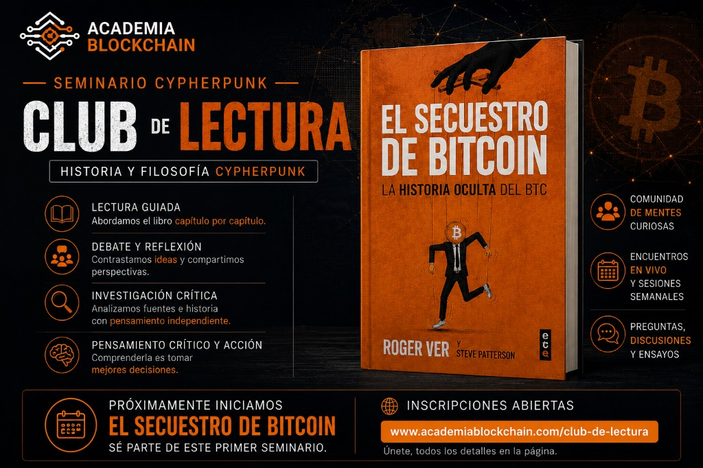

Hola,

Durante casi diez años he intentado hacer algo que considero importante: comprender la historia que hay detrás de la tecnología.

En el camino hemos hablado sobre Bitcoin, el movimiento cypherpunk, criptografía, privacidad, vigilancia, inteligencia artificial y muchos otros temas que, aunque parezcan distintos, comparten una misma pregunta: **¿Cómo cambia la tecnología la relación entre el individuo y el poder?**

Sin embargo, con el tiempo he llegado a una conclusión.

Los videos son un excelente punto de partida, pero muchas conversaciones necesitan más tiempo. Necesitan detenerse, leer las fuentes originales, contrastar ideas y debatir sin la prisa que imponen las redes sociales.

Por eso he decidido inaugurar una nueva etapa en Academia Blockchain.

## Seminario Cypherpunk | Club de Lectura

Nuestro primer libro será **El Secuestro de Bitcoin**, de Roger Ver y Steve Patterson.

No he elegido este libro porque crea que contiene todas las respuestas. Lo he elegido precisamente porque plantea preguntas que vale la pena discutir.

Durante el seminario leeremos cada capítulo, analizaremos su contexto histórico, contrastaremos distintas interpretaciones y reflexionaremos sobre uno de los episodios más debatidos de la historia de Bitcoin.

Mi objetivo no es que todos terminemos pensando igual.

Mi objetivo es construir una comunidad que valore la investigación, el pensamiento crítico y el debate respetuoso.

Si disfrutas cuestionando narrativas, investigando la historia y comprendiendo la tecnología desde una perspectiva filosófica, creo que este espacio puede interesarte.

Las inscripciones ya están abiertas:

👉 [Inscribirse al Club de Lectura](https://www.academiablockchain.com/club-de-lectura)

Será un placer recorrer este camino contigo.

Un abrazo,

**Alejandro Veintimilla**  
Academia Blockchain

