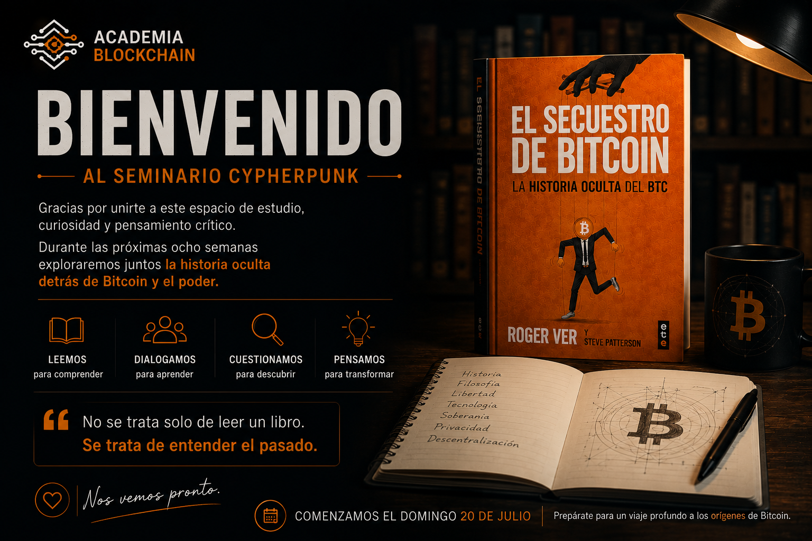

Hola,

Quiero agradecerte por haberte inscrito al Seminario Cypherpunk | Club de Lectura de Academia Blockchain.

Cuando lancé esta iniciativa no sabía cuántas personas estarían dispuestas a dedicar tiempo a estudiar la historia de Bitcoin desde las fuentes originales. Me alegra saber que ya somos un grupo de personas con el mismo interés: comprender mejor la relación entre tecnología, libertad y poder.

Como te comenté, el seminario comenzará el próximo **20 de julio**.

Si todavía no has conseguido el libro *El Secuestro de Bitcoin*, te recomiendo hacerlo durante estos días para que podamos comenzar todos al mismo ritmo.

## ¿Cómo estará organizado?

El seminario tendrá una duración aproximada de **8 semanas**.

Cada semana dedicaremos aproximadamente:

- 📖 **75 minutos de lectura** (puedes repartir ese tiempo como prefieras, por ejemplo tres sesiones de 25 minutos).
- 🎙️ **60 minutos de encuentro en vivo**, donde analizaremos el contexto histórico, debatiremos los argumentos del libro y contrastaremos distintas perspectivas.

No se trata de un club de lectura tradicional.

Mi intención no es reunirnos únicamente para comentar un libro, sino construir un espacio donde podamos estudiar seriamente la historia de Bitcoin, cuestionar narrativas, analizar fuentes y desarrollar pensamiento crítico.

Cada encuentro incluirá, entre otras cosas:

- Contexto histórico.
- Análisis de los acontecimientos descritos en el libro.
- Debate abierto entre los participantes.
- Fuentes adicionales para profundizar en los temas tratados.

Las sesiones quedarán grabadas, de manera que, si alguna semana no puedes asistir en directo, podrás ponerte al día antes del siguiente encuentro.

Durante los próximos días te enviaré el cronograma completo, con las fechas de cada sesión y el plan de lectura correspondiente.

Mientras tanto, te animo a conseguir el libro y reservar un espacio en tu agenda para estas próximas ocho semanas.

Creo que comprender la historia es el primer paso para comprender el presente.

Nos vemos muy pronto.

Un abrazo,

**Alejandro Veintimilla**  
Academia Blockchain

**P.D.** Si ya conseguiste el libro, respóndeme este correo con un simple «✅ Ya lo tengo». Me encantará saber cuántos ya estamos listos para comenzar.

