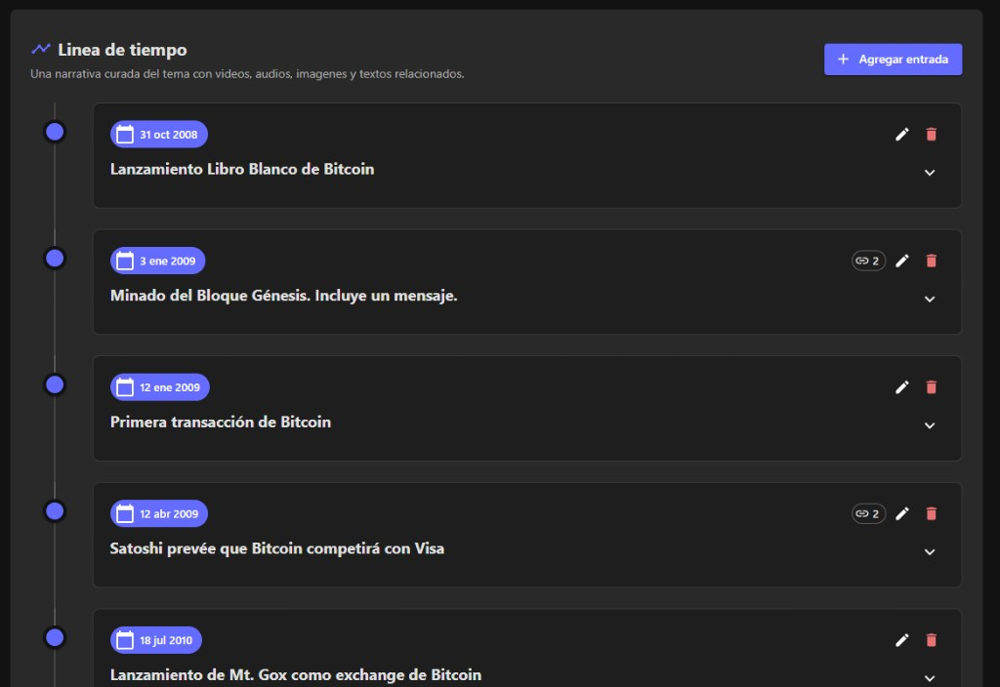

Hola,

Estas dos semanas han sido especialmente activas en Academia Blockchain. Compartí bastante sobre Bitcoin, su filosofía y su tecnología. Aquí tienes un resumen de las novedades.

## El Seminario Cypherpunk ya está en marcha

Esta semana comenzamos la lectura de *Hijacking Bitcoin*, analizando los tres primeros capítulos y una de las preguntas más importantes de la historia de Bitcoin:

**¿Cuál era realmente la intención de Satoshi Nakamoto?**

Durante las próximas semanas seguiremos investigando este y otros temas a través de la lectura, el debate y el análisis de fuentes originales.

Todavía estás a tiempo de unirte al Club de Lectura y participar en las próximas sesiones.

👉 [Inscribirse al Club de Lectura](https://www.academiablockchain.com/club-de-lectura)

## Nuevo Short: ¿Bitcoin fue creado para ser dinero?

En este video analizamos la visión original de Satoshi Nakamoto a partir de sus propios escritos.

En lugar de repetir opiniones populares, revisamos la evidencia histórica para responder una pregunta que sigue generando debate dentro de la comunidad Bitcoin.

👉 [Ver el Short en YouTube](https://www.youtube.com/shorts/LcMDhzcrTr4)

## Nuevo video: «La IA miente sobre los nodos de Bitcoin»

Las herramientas de Inteligencia Artificial son útiles, pero también pueden simplificar o explicar incorrectamente conceptos fundamentales.

En este video analizo uno de los errores más frecuentes que cometen al describir el papel de los nodos completos de Bitcoin, y explico por qué entender su función es esencial para comprender cómo funciona realmente la red.

👉 [Ver el video en YouTube](https://youtu.be/m5jtBS8EuR8)

## Academia Blockchain ahora también está en Spotify

Muchos de los mejores videos de Academia Blockchain ya están disponibles en formato podcast.

Ahora puedes escucharlos mientras conduces, haces ejercicio o simplemente prefieres aprender sin necesidad de ver la pantalla.

👉 [Escuchar en Spotify](https://open.spotify.com/show/033DER84Vz4fQNno4Znh9u)

## Construyendo la Historia de Bitcoin, entre todos

En Academia Blockchain estamos desarrollando una Línea de Tiempo colaborativa sobre la historia de Bitcoin.

El objetivo es crear un recurso abierto y en constante crecimiento que conecte personas, documentos, acontecimientos e ideas que dieron origen al movimiento Cypherpunk y a Bitcoin.

👉 [Explorar la Línea de Tiempo](https://www.academiablockchain.com/content/topics/2/?tab=timeline)

Si te apasiona investigar la historia de Bitcoin, te invito a explorarla y contribuir con nuevas referencias.

---

Gracias por formar parte de esta comunidad.

Nos vemos en el próximo video… y, para quienes participan en el Club de Lectura, en el próximo Seminario Cypherpunk.

— Alejandro  
Academia Blockchain
